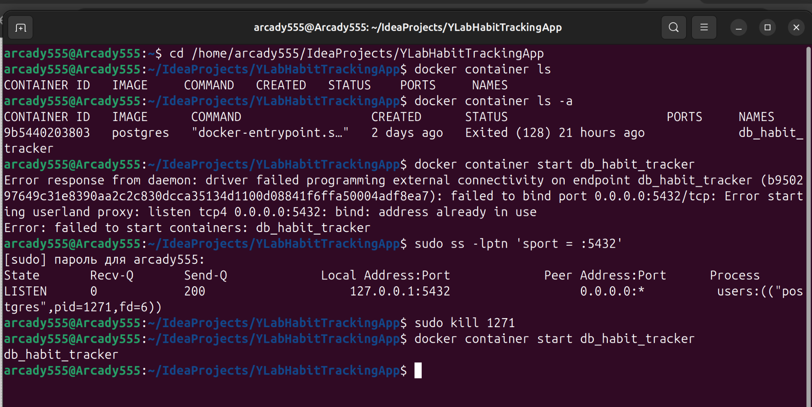
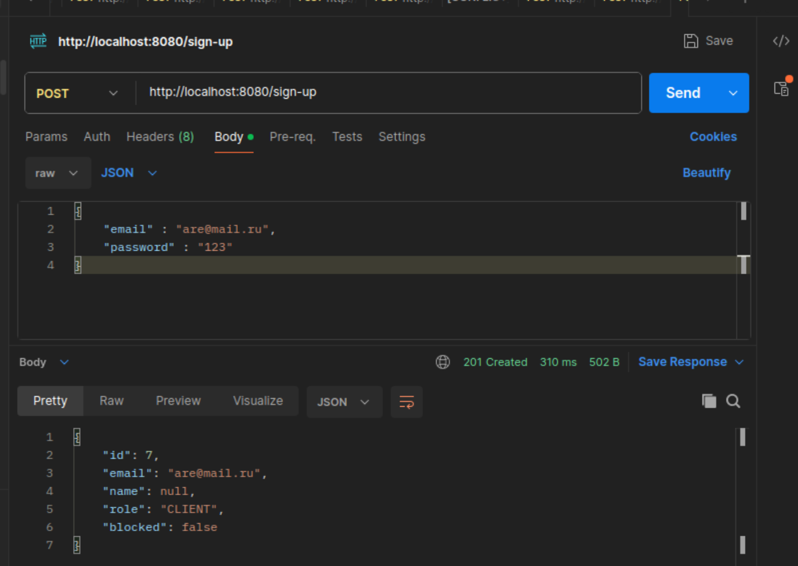
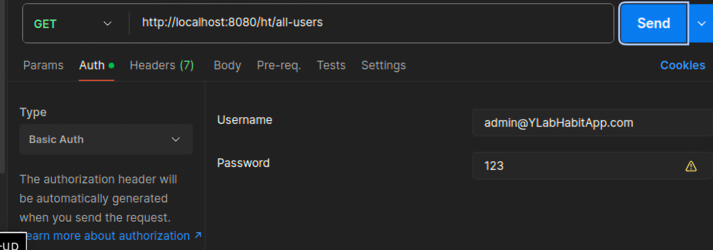
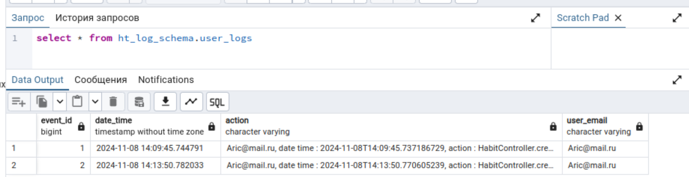
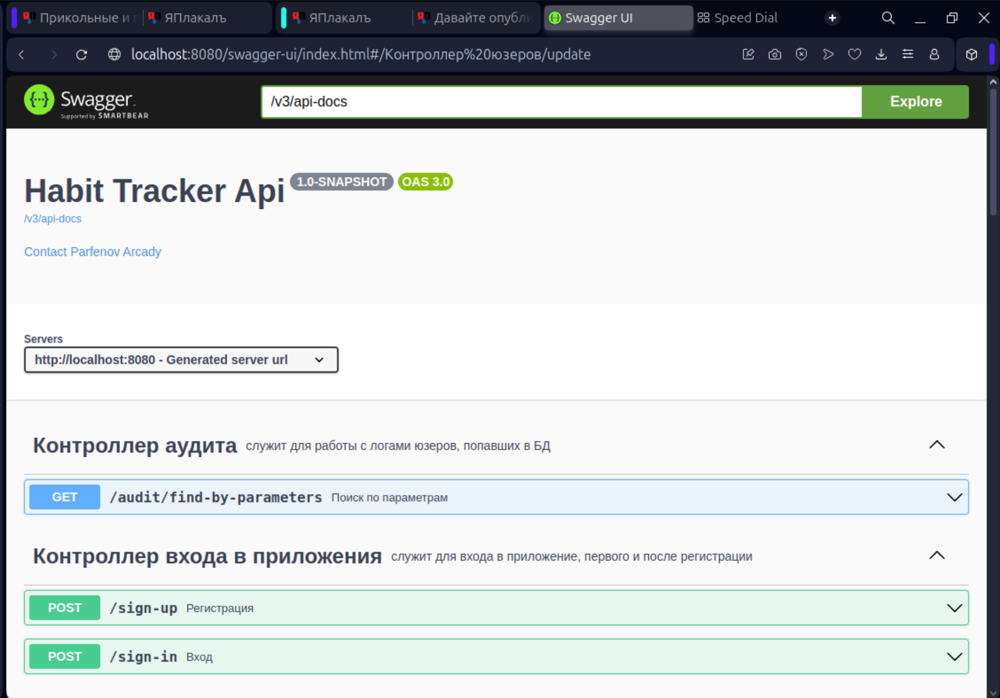

# Y_Lab Домашние задания Интенсива Java (V поток)

Работы ученика Аркадия Парфёнова:

1. [ДЗ №1](https://github.com/Arcady555/YLabHabitTrackingApp/tree/homework_1)
2. [ДЗ №2](https://github.com/Arcady555/YLabHabitTrackingApp/tree/homework2)
3. [ДЗ №3](https://github.com/Arcady555/YLabHabitTrackingApp/tree/homework3)
4. [ДЗ №4](https://github.com/Arcady555/YLabHabitTrackingApp/tree/homework4)
5. [ДЗ №5](https://github.com/Arcady555/YLabHabitTrackingApp/pull/5)  (pull request)


# Приложение для отслеживания привычек. Позволяет пользователям регистрироваться, создавать, управлять своими привычками, отслеживать их выполнение и анализировать прогресс

## Welcome!

Консольное приложение.

## Используемые технологии:

* Java 17

* Maven

* Liquibase

* Docker

### Запуск приложения с Maven
Перейдите в корень проекта через командную строку:
```
cd /home/......../IdeaProjects/YLabHabitTrackingApp
``` 
и выполните команду:
```
docker-compose up -d
```
Вы запустили контейнер для Базы данных. В той же директории выполните команду:
```
docker exec -it db_habit_tracker psql -U role_arcady postgres
```
после чего:
```
CREATE DATABASE y_lab_habit_tracker;
exit 
```

В последующем, если вам придётся заново стартовать этот контейнер(командой "docker start db_habit_tracker"), выполните в командной строке следующие манипуляции(на случай, если порт 5432 или 8080 будет занят):



Перейдите в корень проекта(блок parfencastomstarter) через командную строку:
```
cd /home/......../IdeaProjects/YLabHabitTrackingApp/parfencastomstarter
``` 
и выполните команды:
```
mvn clean install

```
Вы собрали стартер, расположенный в отдельном блоке

Перейдите в корень проекта(блок habittracker) через командную строку:
```
cd /home/......../IdeaProjects/YLabHabitTrackingApp/habittracker
``` 
и выполните команды:
```
mvn clean install

java -jar habittracker-1.0-SNAPSHOT.jar

```


### Работа с приложением
Отправляйте запросы, например через PostMan. (номер порта localhost зависит от настроек Вашего TomCat!)
* Зарегистрируйтесь (http://localhost:8080/sign-up):

  
* Выполните вход в приложение, получите beer токен (http://localhost:8080/sign-in):

  


Следующие запросы доступны только админу. Для этого надо авторизоваться, введя емайл и пароль(сейчас действует авторизация через beer токен):


* Посмотреть список всех пользователей (http://localhost:8080/users/all):


* Посмотреть карточку любого пользователя (http://localhost:8080/users/user/) + ID:

* Найти группу пользователей по параметрам (http://localhost:8080/users/find-by_parameters?role=X&name=X&block=X) где вместо X впишите интересующие Вас параметры. Или не указывайте

* Обновить карточку с данными пользователя (http://localhost:8080/users/update) :


* Удалить карточку пользователя из БД (http://localhost:8080/users/delete/) + ID:

* Посмотреть логи действий клиентов за какой-то период времени (http://localhost:8080/audit/find-by-parameters?userEmail=user@mail.ru&action=act&dateTimeFrom=2023-01-01T00:00&dateTimeTo=2023-08-01T00:00)



Следующие запросы доступны простым клиентам. Авторизация так же обязательна:

* Создать привычку (http://localhost:8080/habits/create):

* Выполнить привычку (http://localhost:8080/habits/perform/) + ID привычки:

* Изменить привычку (http://localhost:8080/habits/update):

* Посмотреть все свои привычки (http://localhost:8080/habits/your-all-list):

* Посмотреть свои привычки,  выбрав по параметрам (http://localhost:8080/habits/your-list-by-param?usefulness=X&active=X&name=X&description=X&dateOfCreate=X&frequency=X) где вместо X впишите интересующие Вас параметры. Или не указывайте:

* Посмотреть свои привычки к исполнению на сегодня (http://localhost:8080/habits/your-today-list):

* Посмотреть статистику по своим активным привычкам (http://localhost:8080/habits/statistic):

* Запросить смену пароля(придёт код на емайл) (http://localhost:8080/users/request-password-reset):

* Сменить свой пароль (http://localhost:8080/users/reset_password):


* Посмотреть SWAGGER (доступно без авторизации) (http://localhost:8080/swagger-ui/index.html:




## Have a good job!
