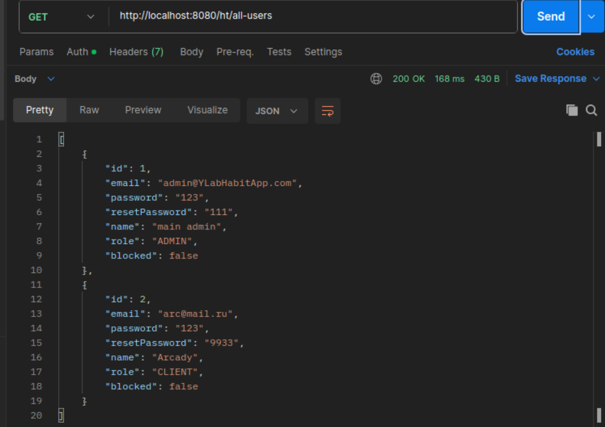
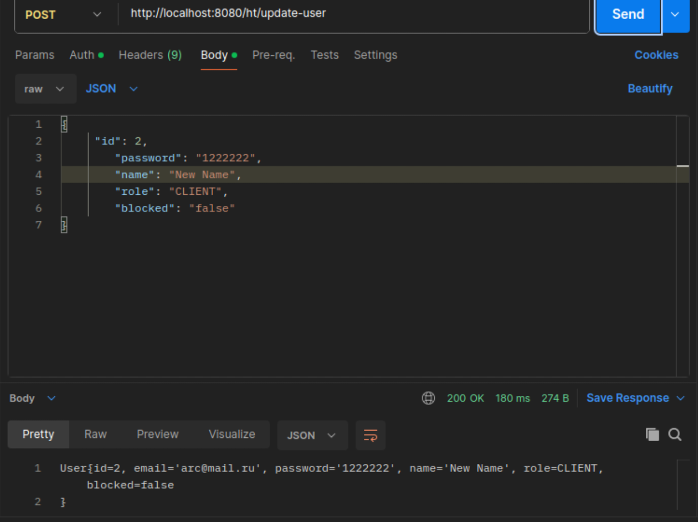

# Y_Lab Домашние задания Интенсива Java (V поток)

Работы ученика Аркадия Парфёнова:

1. [ДЗ №1](https://github.com/Arcady555/YLabHabitTrackingApp/tree/master/homework_1)
2. [ДЗ №2](https://github.com/Arcady555/YLabHabitTrackingApp/tree/master/homework2)
3. [ДЗ №3](https://github.com/Arcady555/YLabHabitTrackingApp/tree/master/homework3)
4. [ДЗ №4](https://github.com/Arcady555/YLabHabitTrackingApp/pull/4)  (pull request)


# Приложение для отслеживания привычек. Позволяет пользователям регистрироваться, создавать, управлять своими привычками, отслеживать их выполнение и анализировать прогресс

## Welcome!

Консольное приложение.

## Используемые технологии:

* Java 17

* Maven

* Liquibase

* Docker

### Запуск приложения с Maven
Перейдите в корень проекта через командную строку:
```
cd /home/......../IdeaProjects/YLabHabitTrackingApp
``` 
и выполните команду:
```
docker-compose up -d
```
Вы запустили контейнер для Базы данных.В той же директории выполните команду:
```
docker exec -it db_habit_tracker psql -U role_arcady postgres
```
после чего:
```
CREATE DATABASE y_lab_habit_tracker;
exit 
```

В последующем, если вам придётся заново стартовать этот контейнер, выполните в командной строке следующие манипуляции:


Перейдите в корень проекта(блок separatedrun) через командную строку:
```
cd /home/......../IdeaProjects/YLabHabitTrackingApp/separaterun4
``` 
и выполните команды:
```
mvn clean install
java -jar ht.jar
```
Вы запустили liquibase, создали таблицы

Пройдите в соседний блок:

```
cd /home/......../IdeaProjects/YLabHabitTrackingApp/tomcatrun
```
и выполните команды:
```
mvn clean install
```

Запустите TomCat. Например в консоли:
```
sudo systemctl start tomcat
```
Поместите файл tomcatrun/target/ht.war  в Тomcat  в папку webapps .


### Работа с приложением
Отправляйте запросы, например через PostMan. (номер порта localhost зависит от настроек Вашего TomCat!)
* Зарегистрируйтесь (http://localhost:8080/ht/sign-up):
  
*
Следующие запросы доступны только админу. Для этого надо авторизоваться, введя емайл и пароль(сейчас действует БАЗОВАЯ авторизация):


* Посмотреть список всех пользователей (http://localhost:8080/ht/all-users):
  

* Посмотреть карточку любого пользователя (http://localhost:8080/ht/user?id=) + ID:

* Найти группу пользователей по параметрам (http://localhost:8080/ht/users-by-parameters?role=X&name=X&block=X) где вместо X впишите интересующие Вас параметры. Или пробел
* Обновить карточку с данными пользователя (http://localhost:8080/ht/update-user) :
  

* Удалить карточку пользователя из БД (http://localhost:8080/ht/delete-user?id=) + ID:
* Посмотреть какие привычки есть у клиента (http://localhost:8080/ht/habits-of-user?email=) + email юзера
* Посмотреть логи действий клиентов за какой-то период времени (http://localhost:8080/ht/users_logs?dateTimeFrom=2023-01-01T00:00&dateTimeTo=2023-08-01T00:00)

Следующие запросы доступны простым клиентам. Авторизация так же обязательна:


## Have a good job!
